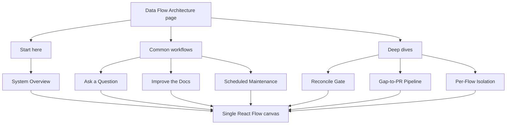
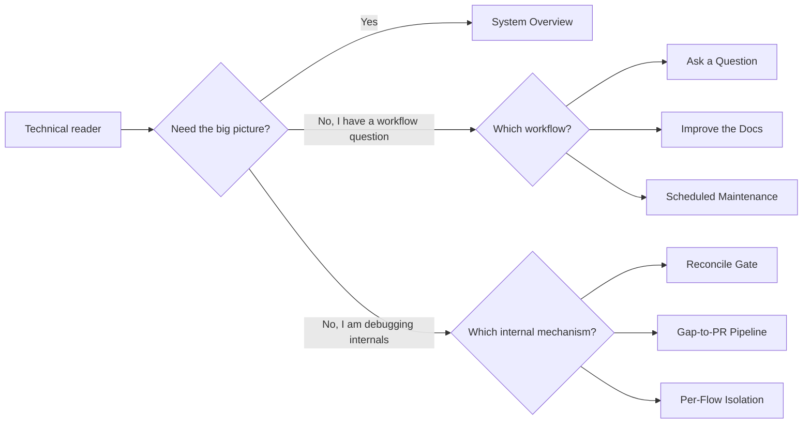

# Dataflow Page Organization Design

## Goal

Reorganize the `/dataflow` page so busy technical users can understand the system quickly, while still giving maintainers and curious users a clear route into implementation details.

The current page presents seven diagrams as equal tabs. That makes diagrams with different purposes feel like peer concepts: product overview, user workflows, scheduler operations, and job internals all compete for attention.

## Audience

Primary users are technical but busy. They need a fast high-level model first, then optional depth when they are debugging, operating, or extending the system.

## Recommended Structure

The page should use progressive disclosure:

1. **Start Here**
   - `System Overview`
   - A single default diagram showing the whole product loop:
     `Sources -> Index -> Ask/Retrieve -> Answer -> Learn from gaps -> Draft proposals -> PRs -> Re-index`

2. **Common Workflows**
   - `Ask a Question`
   - `Improve the Docs`
   - `Scheduled Maintenance`

3. **Deep Dives**
   - `Reconcile Gate`
   - `Gap-to-PR Pipeline`
   - `Per-Flow Isolation`

This keeps the first read simple, then lets users choose a path based on what they are trying to understand.

## Flow Renames

| Current title | New title | Purpose |
| --- | --- | --- |
| Overview | System Overview | High-level end-to-end system loop |
| Ask Flow | Ask a Question | Web/MCP question answering workflow |
| Continuous Improvement Cycle | Improve the Docs | Feedback and gaps becoming proposals/PRs |
| Automation & Patrol | Scheduled Maintenance | Background tasks and patrol lenses |
| Reconcile Gate | Reconcile Gate | Shared proposal conflict-resolution mechanism |
| Gap to PR Jobs | Gap-to-PR Pipeline | Detailed job flow for automated gap proposals |
| Per-Flow Jobs | Per-Flow Isolation | How configured flows run independently |

## UI Design

Keep the existing React Flow canvas, minimap, controls, legend, graph renderer, layout logic, and authored graph data.

Replace the single flat tab row with grouped navigation:

```text
Data Flow Architecture

Start here
[System Overview]

Common workflows
[Ask a Question] [Improve the Docs] [Scheduled Maintenance]

Deep dives
[Reconcile Gate] [Gap-to-PR Pipeline] [Per-Flow Isolation]
```

Mockup of the grouped page structure:



Mockup of the intended reader path:



The active item should still switch the same React Flow canvas. The default active diagram should remain the overview, now titled `System Overview`.

The groups should be visual hierarchy only. They should not create extra routes, extra canvases, nested cards, or a wizard-like experience.

## Component Impact

- `apps/web/src/components/dataflow/flows.ts`
  - Rename displayed titles.
  - Add grouping metadata for navigation, or export a small grouped navigation model derived from existing flow definitions.

- `apps/web/src/components/DataFlowPanel.tsx`
  - Render grouped navigation instead of mapping all `FLOWS` into one flat tab row.
  - Keep `activeFlow`, `buildFlowGraph`, `layoutGraph`, React Flow rendering, and model interpolation behavior.

- `apps/web/src/app/styles.css`
  - Add or adjust styles for grouped tab sections.
  - Preserve dense, scan-friendly console styling.

- Existing tests
  - Update tests that assert titles or flow metadata.
  - Keep validation that all edge and group references resolve.
  - Keep the reconcile gate post-Scope-B assertions.

## Testing

Run the dataflow tests:

```powershell
node --import tsx --test "apps/web/src/components/dataflow/flows.test.tsx" "apps/web/src/components/dataflow/layout.test.tsx"
```

If the UI change touches rendering behavior beyond simple navigation markup, also run the relevant web test suite or a browser check for `/dataflow`.

## Out of Scope

- Redrawing or rewriting the seven diagrams.
- Changing scheduler, proposal, reconciliation, or source-sync behavior.
- Adding new routes.
- Adding explanatory marketing copy or a landing page.
- Replacing React Flow or the dagre layout pass.

## Success Criteria

- A first-time technical reader can identify the high-level system loop immediately.
- The seven diagrams no longer appear as seven equal abstractions.
- Users who need internals can still reach the reconcile gate, gap-to-PR job flow, and per-flow isolation views quickly.
- The implementation remains a small UI organization change with existing graph definitions and rendering behavior intact.
